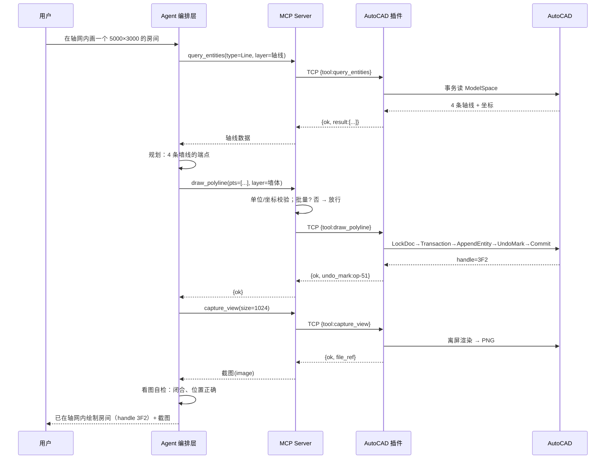

# AutoCAD MCP · 架构

> 版本：v2.0 ｜ 日期：2026-09-08
> 关键词：MCP、AutoCAD .NET API (ObjectARX)、Streamable HTTP、命令队列、视觉反馈

**AutoCAD MCP** = 让 Claude / ChatGPT / Codex / 自研 Agent 通过 MCP 协议控制 AutoCAD 的**通用工具库**。

---

## 〇、定位与现状

**目标**：一套完整、不分行业的 AutoCAD 操作工具集，任何 MCP 客户端都能接。类似
`puran-water/autocad-mcp`，但基于完整版 AutoCAD 的 ObjectARX .NET API（而非 LT 的 AutoLISP）。

**当前实现**（P0 + P1 + P2，51 个工具，AutoCAD 2014 实测通过）：

```
Claude Code ──HTTP (type:http, /mcp)──▶ AcadMcp.Plugin.dll  (NETLOAD 进 AutoCAD)
                                          ├─ HttpListener 127.0.0.1:7130/mcp
                                          ├─ 手写 MCP Streamable HTTP (JSON-RPC)
                                          ├─ 51 个工具
                                          ├─ 主线程调度器 (Application.Idle 队列)
                                          ├─ 命令队列桥 (SendStringToExecute + 结果文件轮询)
                                          └─ 滚动文件日志
                                                 │ ObjectARX .NET API / acedEvaluateLisp
                                                 ▼
                                          AutoCAD 2014/2018/2020 · DWG
```

**单组件**：插件内嵌 HTTP，没有独立进程、没有 socket 桥、没用 `ModelContextProtocol` SDK
（它不支持 .NET Framework）。详细的实现分阶段说明见「附录 C」。

**第二～五章描述的是"若把 MCP 承载拆成独立进程"的分层设想（当前不需要）。
第六章讲编排：多数情况用 Claude Code 的 `CLAUDE.md` + skills + permissions 就够了，
只有面向非 Claude 客户端 / 产品化 / 无人值守 / 硬性审计才需要独立编排层。
想了解已经做了什么，直接看附录 C 和 README。**

---

## 一、设计原则

| 原则 | 现状 |
|---|---|
| **能力沉淀为 MCP，编排独立成层** | ✅ AutoCAD 操作全在插件的 MCP 工具里；Agent 层可选、独立（P4） |
| **危险操作显式授权** | 🔸 `eval_lisp` 默认关、`run_command`/`eval_lisp` 标 DANGER、全量日志、只读模式（P2.5）；逐次弹窗审批留 P4 |
| **视觉闭环** | 🔸 有 `capture_view`（模型按需调），未强制"每步回图"（P4 Agent 层的纪律） |
| **一切写操作可回滚** | 🔸 全局 `undo` + `mark`/`rollback` 命名标记 + 首个写操作前自动备份（P2.5）；每步自动打标留 P4 |
| **单实例串行、会话隔离** | 🔸 写操作在主线程串行；多文档 / 多实例隔离留 P3 |

---

## 二、分层总览（远期目标形态，非当前实现）

> 当前只实现了下图的 ④⑤ 两层（且 ④ 内嵌 HTTP 直接对外，不经 ③）。
> ①②③ 是 P4+ 的可选扩展。当前实现图见「〇、定位与现状」。

```
┌─ ① 接入层 ────────────────────────────────────────────────┐
│  Claude Desktop / Cursor / VS Code        (交互式，走 MCP)   │
│  自研 Web / 桌面前端                        (产品化，走 HTTP) │
│  定时器 / CI / 批处理触发器                  (无人值守)       │
└───────────────────────────┬──────────────────────────────┘
                            │  MCP(stdio) │ HTTP/WS
┌───────────────────────────▼──────────────────────────────┐
│  ② Agent 编排层   (Claude Agent SDK, TS/Python)            │
│  ├─ System Prompt 组装：角色 + 制图规范 + 当前图纸上下文    │
│  ├─ 上下文管理：会话状态 / 压缩 / 图纸快照                  │
│  ├─ RAG：制图标准库、图块库、企业规范检索                   │
│  ├─ 权限门禁：canUseTool 策略（分级审批）                   │
│  ├─ 工作流引擎：出图 SOP、校审流程、多步编排                │
│  ├─ 多 MCP 调度：AutoCAD + 规范库 + Excel + PDM             │
│  └─ 观测：结构化日志 / 链路追踪 / 成本 / 审计               │
└───────────────────────────┬──────────────────────────────┘
                            │  MCP (stdio 本地 / SSE 远程)
┌───────────────────────────▼──────────────────────────────┐
│  ③ AutoCAD MCP Server   (.NET 8 独立进程)                  │
│  ├─ MCP 协议：工具注册 / JSON-Schema / 传输                 │
│  ├─ 能力路由：read / write / modify / render / script      │
│  ├─ 前置校验：单位换算、坐标系转换、handle 存在性           │
│  ├─ 会话 → 文档 映射                                        │
│  ├─ 鉴权：token 握手；危险工具限流                          │
│  └─ 桥接客户端：TCP JSON → 插件（连接保活）                 │
└───────────────────────────┬──────────────────────────────┘
                            │  TCP JSON (127.0.0.1, token)
┌───────────────────────────▼──────────────────────────────┐
│  ④ AutoCAD 进程内插件   (.NET, NETLOAD / 启动加载)         │
│  ├─ Socket Server（后台线程，accept + 每连接一 handler）    │
│  ├─ 主线程调度器（Application.Idle 队列 + 阻塞等待）        │
│  ├─ 命令分发器（tool → handler）                            │
│  ├─ 事务 / 文档锁 / UndoMark 管理                           │
│  ├─ 实体：绘制 / 查询 / 修改 / 图层 / 标注 / 图案填充       │
│  ├─ 离屏渲染 → PNG（GraphicsSystem / PLOT）                 │
│  └─ 逃生舱：execute_command / execute_lisp                  │
└───────────────────────────┬──────────────────────────────┘
                            │  ObjectARX .NET API
┌───────────────────────────▼──────────────────────────────┐
│  ⑤ AutoCAD（GUI）  /  accoreconsole（headless）           │
│     DWG 数据库                                             │
└──────────────────────────────────────────────────────────┘
```

---

## 三、组件职责清单

**当前实现**：只有 ④⑤，且 ④ 把 ③ 的职责（协议、schema）也一并做了。

| # | 组件 | 状态 | 进程 | 语言 / 技术 | 职责 |
|---|---|---|---|---|---|
| ④ | AutoCAD MCP 插件 | **已实现** | AutoCAD 内 | C# + ObjectARX (net48) | HTTP + 手写 MCP 协议、51 个工具、线程调度、事务、命令队列桥、截图、日志 |
| ⑤ | AutoCAD | — | — | Autodesk 2014/2018/2020 | DWG 引擎 |

**远期扩展**（P4+，未实现）：

| # | 组件 | 语言 / 技术 | 职责 |
|---|---|---|---|
| ① | 接入层 | — | 收集用户意图、展示结果 / 截图、审批交互 |
| ② | Agent 编排层 | Agent SDK (TS/Py) | 提示词、上下文、RAG、权限门禁、工作流 SOP、多 MCP 调度 |
| ③ | 独立 MCP Server 进程 | — | 若要把 MCP 承载从插件里拆出来（当前不需要，插件内嵌 HTTP 即可） |
| — | RAG 子系统 | 向量库 + Embedding | 制图规范 / 图块库检索，作为一个 MCP |

---

## 四、④ 进程内插件 —— 详细设计

> 4.1 线程模型、4.4 事务已按此实现。4.2 是完整工具规划（实际见 README 的 51 个工具清单），
> 4.3 的统一返回信封（`ok/warnings/undo_mark`）**未采用** —— 当前工具直接返回文本 / JSON 字符串，
> 错误走 MCP 的 `isError` + hint。命名 UndoMark 留 P2.5。

### 4.1 线程模型（关键难点）

AutoCAD .NET API **只能在主线程调用**。Socket 在后台线程，必须跨线程编组：

```
后台线程                          主线程 (Application.Idle)
─────────                          ──────────────────────
accept 连接
  └─ handler 线程
       读一行 JSON
       ├─ 解析 {tool, args}
       ├─ 构造 Action，入队 ───────▶ ConcurrentQueue<Action>
       ├─ ManualResetEventSlim.Wait()      Idle 触发 → 出队执行:
       │                                     LockDocument()
       │                                     StartTransaction()
       │                                     执行 API
       │                                     Commit()
       │   ◀─────────────────────────────── 结果写回 + event.Set()
       ├─ 序列化 {ok, result}
       └─ 写回 socket，读下一行
```

- 交互式（GUI）：`Application.Idle` 队列，如上
- 无人值守（accoreconsole）：**没有可靠的 Idle 泵**，改为「每任务一进程」——MCP server 为每个批处理任务 `spawn accoreconsole.exe /i job.dwg /s job.scr`，脚本内 NETLOAD 插件并顺序执行；执行完导出、进程退出

### 4.2 工具目录（按能力分级）

| 级别 | 工具 | 说明 |
|---|---|---|
| **read**（自动放行） | `get_drawing_meta` | 单位、界限、范围、当前图层、坐标系 |
| | `get_layers` / `get_blocks` / `get_text_styles` | 表资源清单 |
| | `query_entities(filter)` | 按类型 / 图层 / 窗口筛选实体，返回 handle + 摘要 |
| | `get_entity(handle)` | 单实体完整属性 |
| **write-draw**（按模式） | `draw_line` / `draw_polyline` / `draw_circle` / `draw_arc` | 基本图元 |
| | `draw_text` / `add_dimension` / `add_hatch` | 文字、标注、填充 |
| | `insert_block(name, pos, scale, rot)` | 插入图块（配合 RAG 选块） |
| **write-modify**（按模式） | `move` / `copy` / `rotate` / `scale` / `mirror` / `offset` | 变换 |
| | `set_property(handle, prop, value)` | 改图层 / 颜色 / 线型等 |
| **write-danger**（永远审批） | `erase(handles)` | 删除 |
| | `execute_command(str)` / `execute_lisp(str)` | 逃生舱，默认关闭，按部署开启 |
| **layer/style** | `add_layer` / `set_current_layer` / `set_layer_props` | |
| **render** | `capture_view(view?, size)` → PNG | 视觉反馈核心 |
| | `zoom_extents` / `set_view(preset)` | 出图前调整视口 |
| **doc** | `save` / `save_as` / `list_open_documents` | |

### 4.3 统一返回信封

```json
{
  "ok": true,
  "result": { "handles": ["2A3", "2A4"] },
  "warnings": ["图层 '轴线' 不存在，已自动创建"],
  "undo_mark": "mcp-op-00042",
  "elapsed_ms": 38
}
```

### 4.4 事务与回滚

- 每个 write 工具：`LockDocument` → `StartTransaction` → 操作 → 起一个命名 Undo Mark（`SendStringToExecute("_UNDO _Mark")` 或 `TransactionManager`）→ `Commit`
- MCP server / Agent 记录每步 `undo_mark`，提供 `rollback_to(mark)` 工具（内部 `_UNDO _Back`）
- 会话开始：自动 `save_as` 一份 `*.session-backup.dwg`

---

## 五、③ 独立 MCP Server —— 详细设计（P4+ 设想，未实现）

> **当前不存在独立 MCP Server 进程。** 插件（④）直接内嵌 HttpListener + 手写 MCP Streamable HTTP，
> 手写而非用 `ModelContextProtocol` SDK（该 SDK 不支持 .NET Framework，AutoCAD 2014 的 CLR）。
> 本节描述的是"若将来要把 MCP 承载拆成独立进程"的设计，届时才需要。

### 5.1 传输

| 场景 | 传输 | 说明 |
|---|---|---|
| 本地交互（Claude Desktop / 本地 Agent） | **stdio** | 子进程拉起，日志走 stderr |
| 远程 Agent / 产品化 | **HTTP + SSE** | Kestrel，放内网 / VPN，加 API Key |

### 5.2 职责细分

- **工具映射**：`[McpServerToolType]` 特性类 → 自动生成 JSON-Schema
- **前置校验**（在转发给插件前）：
  - 单位换算：用户说“5 米” → 按 `get_drawing_meta` 的图形单位转成图形单位数值
  - 坐标系：WCS / UCS 转换
  - handle 校验：`modify` / `erase` 前先 `get_entity` 确认存在，否则直接报错，不打扰插件
  - 数量阈值：批量 > N 实体 → 在返回里标 `requires_approval: true`
- **会话映射**：MCP session id ↔ AutoCAD 文档（`list_open_documents` + 打开 / 切换）
- **桥接客户端**：到插件的 TCP 连接**保活复用**（不是每次新建），带心跳；断线重连
- **鉴权**：启动时与插件用共享 token 握手；`execute_*` 独立限流
- **可观测**：每次调用输出结构化日志（tool、参数摘要、耗时、ok/err）到 stderr → 采集

### 5.3 Contracts 共享

```
AcadMcp.Contracts/
├─ ToolNames.cs          // 常量，防手写错
├─ Requests/  (DrawLineArgs, EraseArgs, ...)
├─ Envelope.cs           // {ok, result, warnings, undo_mark, elapsed_ms}
└─ DrawingMeta.cs
```

③ 和 ④ 都引用，JSON 字段一处定义。

---

## 六、编排层（P4）—— 首选给 Claude Code 配置，独立系统仅按需

> **当前没有、多数情况也不需要独立"编排层"。** 用户在 Claude Code / Claude Desktop 里直接驱动 51 个工具，
> 效果已经很好 —— 因为 **Claude Code 本身就是编排层**（agent 循环、上下文管理、权限、子代理都内置）。

### 6.1 P4 首选形态：`.claude/` 模板 + 一个规范检索 MCP

不是"再写一个系统"，而是给消费方（在 Claude Code 里用本工具库的人）配一套东西：

| 编排职责 | 用 Claude Code 现成机制 |
|---|---|
| 角色 / 制图纪律 / 单位约定 / "先 query 再 modify、改完 `capture_view` 自检" | `CLAUDE.md`（项目级或全局） |
| 出图 SOP（墙体绘制、标注补全、图框标题栏、校审出图） | skills / slash commands（`/plot`、`/review`…） |
| 权限门禁（只读放行、`erase`/`run_command`/`eval_lisp` 需确认） | `.claude/settings.json` 的 permissions + hooks |
| 当前图纸上下文注入 | 会话开头让它先调 `get_status` / `list_layers` |
| 多工具协作（AutoCAD + Excel BOM + PDM） | 直接在 `.mcp.json` 配多个 MCP server |
| 会话审计 | Claude Code transcript + 插件自己的日志文件 |

**唯一需要新写的组件**：`mcp:standards` —— 一个小 MCP，把企业制图标准（GB/T 图层命名、线型、字高）
和图块库做成可检索的工具（`search_standard` / `find_block`）。因为几百页规范不该塞进 `CLAUDE.md`。

工作量：`.claude/` 模板几天，`mcp:standards` 一两周。**不是"月"级的独立 codebase。**

### 6.2 什么时候才真的需要独立编排层

以下情况 Claude Code 配置覆盖不了，才值得用 Claude Agent SDK 写独立编排：

1. **给非 Claude 客户端用** —— ChatGPT / Codex / 自研 Agent 编排能力弱，要把制图纪律"焊"进服务端
2. **产品化** —— 给不用终端的设计师，需要专门 UI，UI 自带 agent loop
3. **无人值守** —— 夜间批量处理 N 张 dwg、加图框、出 PDF，没有人在环
4. **硬性保证** —— 生产图纸每次改动强制审批 + 不可篡改审计（Claude Code 权限是会话级、用户能"全部允许"）

### 6.3 独立编排层设计（仅当 6.2 命中）

用 Claude Agent SDK（TS/Python），独立 codebase，不改插件。要点：

- **会话生命周期**：开始 → 备份 DWG + 读图纸上下文 + RAG 预取规范 + 建审计记录；
  每轮 → 规划 → `tool_use → 门禁 →（审批）→ 执行`，写操作后 `capture_view` 自检；
  结束 → 审计落库（谁 / 何时 / 哪张图 / 什么操作 / 结果 / 截图 / 谁批准）
- **System prompt 分块**（利于缓存）：固定角色纪律 ｜ 半固定规范片段（RAG）｜ 每会话图纸上下文 ｜ 易变请求
- **`canUseTool` 门禁**：`get_*`/`query_*`/`capture_view` 放行；`draw_*` 批量>N 审批；
  `move/rotate/…` 审批；`erase`/`save_as` 审批 + diff 预览；`run_command`/`eval_lisp` 永远审批
- **工作流 SOP**（子 Agent / 模板）：墙体绘制、标注补全、图框标题栏、校审出图 —— 每步带检查点
- **多 MCP 调度**：`mcp:autocad` + `mcp:standards` + `mcp:excel` + `mcp:pdm`
- **观测**：OpenTelemetry 链路 + 每会话成本 + 不可变审计表

---

## 七、一次完整请求的时序（远期分层形态；当前无 Agent/Server 两层）

> 当前实际链路：Claude Code ──HTTP /mcp──▶ 插件（HttpListener → 主线程 Idle 队列 → ObjectARX）。
> 没有下图的 A/M 两个参与方；`capture_view` 用 `PrintWindow` 抓窗口而非离屏渲染；无 UndoMark。



---

## 八、部署形态

### 形态 A：交互式单机 —— **当前形态**

```
本机:
  Claude Code / Claude Desktop ──HTTP (type:http)──▶ 127.0.0.1:7130/mcp
                                                        （AcadMcp.Plugin.dll，NETLOAD 进 AutoCAD）
全部本机回环。手动 NETLOAD；只对接当前活动文档。
```

### 形态 B：产品化 C/S（远期）

```
浏览器 ──HTTPS──▶ Agent 服务(内网)
                     │
                     ▼
              CAD 工作站集群 (Windows)
              每会话一个 AutoCAD 实例 / Windows 容器，插件随实例
会话调度器分配 / 回收实例，实例间图纸隔离。需先做多文档隔离（P3）+ HTTP 鉴权（P2.5）。
```

### 形态 C：无人值守批处理（远期）

```
定时器/CI ──▶ Agent(headless) ──▶ MCP Server
                                    │ 每任务:
                                    ▼
                          spawn accoreconsole /i x.dwg /s x.scr
                          (脚本内 NETLOAD 插件, 顺序执行, 出图, 退出)
无 GUI，按任务并行多进程。
```

---

## 九、关键难点与对策

### 已解决（P0–P2 踩过的坑）

| 难点 | 对策 |
|---|---|
| .NET API 只能主线程调用 | `Application.Idle` 队列 + `ManualResetEventSlim`；HTTP 回调线程编组过去 |
| `Application.Idle` 跑在应用上下文 | 每个工具（含只读）都 `doc.LockDocument()`，否则 `eLockViolation` |
| `(command)` 从 `acedEvaluateLisp` 应用上下文不工作 | trim/fillet 等改用 `SendStringToExecute` 送命令队列 + HTTP 线程轮询结果文件；`activate=false` |
| HTTP 请求体中文乱码 | 强制按 UTF-8 解码，不信 `Content-Type` 的 charset（.NET FW 缺省退回系统 ANSI） |
| `draw_text` 中文显示不了 | 自动建基于宋体的文字样式 |
| `MdiActiveDocument` 后台线程为 null | 命令队列桥里先 `MainThread.Invoke` 取 doc 引用 |
| `DwgVersion.Current` 在 2014 无效 | `save_as` 按 AC1032→AC1027→AC1024→AC1021 逐个回退 |
| 逃生舱滥用（`eval_lisp` 任意代码执行） | 默认关闭，`MCPLISP` / 环境变量开启，完整代码入日志，`dangerous` 标记 |
| 插件热更新 | 做不到（.NET 程序集不能热卸载）—— 关 AutoCAD → 重编 → 重开 NETLOAD |

### 待解决（P3 / P4）

| 难点 | 计划对策 |
|---|---|
| 破坏性操作风险 | ✅ P2.5：只读模式 + 会话前备份 + `mark`/`rollback` + token；逐次审批留 P4 |
| HTTP 端口无鉴权 | ✅ P2.5：`MCPTOKEN` / `ACADMCP_TOKEN` |
| 单位 / 坐标系混乱 | P3：工具层单位换算、UCS 支持 |
| 并发写冲突（用户手动操作 + Claude 同时改） | 写操作串行化已有；多会话需多实例 + session→document 绑定（P3） |
| 模型盲画坐标 / 比例错位 | 靠 `capture_view` 自检 + 分步；彻底解决要 P4（规范上下文、强制看图纪律） |

---

## 十、目录结构（当前）

```
D:\AutoCADMCP\
├─ ARCHITECTURE.md / README.md
├─ AutoCadMcp.slnx  ·  .mcp.json[.example]
├─ scripts/test-mcp.ps1              端到端冒烟（保持纯 ASCII，PS 5.1 按 GBK 读 .ps1）
├─ src/AcadMcp.Plugin/               插件（net48 / x64，唯一产物）
│  ├─ PluginEntry.cs                 IExtensionApplication + 命令 MCPSTART/STOP/STATUS/MCPLISP
│  ├─ Mcp/
│  │  ├─ HttpServer.cs               HttpListener + Origin 校验 + 协议版本头
│  │  ├─ McpDispatcher.cs            initialize / tools.list / tools.call / ping / 错误 hint
│  │  ├─ Tool.cs · ToolResult.cs · Schema.cs · Args.cs · JsonRpc.cs
│  │  └─ Log.cs                      滚动文件日志
│  ├─ Acad/
│  │  ├─ MainThread.cs               Application.Idle 队列 + ManualResetEventSlim
│  │  ├─ AcadContext.cs · Draw.cs · Modify.cs · Edit.cs · Dim.cs · HatchOps.cs
│  │  ├─ Layers.cs · Blocks.cs · Query.cs（含 SelectionStore）· Measure.cs
│  │  ├─ ViewDoc.cs · Capture.cs（PrintWindow）· TextStyles.cs
│  │  └─ Lisp.cs                     acedEvaluateLisp 同步 eval + 命令队列桥 RunViaCommandQueue
│  └─ Tools/ToolCatalog.cs           51 个工具的注册
└─ test/AcadMcp.ProtocolTest/        协议一致性测试（link Mcp/*.cs，不依赖 AutoCAD）
```

未建：`AcadMcp.Server`（独立进程）、`AcadMcp.Contracts`、Agent 编排、Web 前端 —— 见附录 C。

---

## 十一、技术选型（当前）

| 项 | 选型 | 备注 |
|---|---|---|
| 插件 | C# + ObjectARX .NET API (`acdbmgd`/`acmgd`/`accoremgd`)，**net48 / x64** | 按 AutoCAD 2020 程序集编译，2014 上兼容（同 .NET 4 CLR） |
| 构建 | `dotnet build` + `Microsoft.NETFramework.ReferenceAssemblies` | 无需 Visual Studio |
| MCP 协议 | **手写** JSON-RPC over Streamable HTTP（`HttpListener`） | `ModelContextProtocol` SDK 不支持 .NET Framework |
| JSON | `Newtonsoft.Json` 13（自带，唯一运行时依赖） | 单文件、AutoCAD 里零冲突 |
| LISP 桥 | `acedEvaluateLisp`（accore.dll，同步）+ `SendStringToExecute` 命令队列 | `(command)` 需文档上下文，见附录 C |
| 截图 | `PrintWindow(PW_RENDERFULLCONTENT)` 抓主窗口 | 对遮挡稳健；P3 可换离屏渲染 |
| 日志 | 滚动文件 `%LOCALAPPDATA%\AcadMcp\logs\` | 无外部依赖 |

远期（P4）选型：Agent 编排用 Claude Agent SDK（TS/Py）；RAG 用 pgvector/Qdrant；
观测 OpenTelemetry；审计 PostgreSQL —— 详见第五、六章。

---

## 十二、演进路线

| 阶段 | 状态 | 交付 |
|---|---|---|
| **P0** | ✅ 完成 | 插件 + 内嵌 HTTP + 手写 MCP；13 个工具（状态 / 图层 / 画线圆多段线文字 / 删除 / 缩放 / 保存 / run_command） |
| **P1** | ✅ 完成 | `capture_view`（PrintWindow 截图）、`get_entity`、move/copy/rotate/scale/offset、insert_block、save_as、undo |
| **P1.5** | ✅ 完成 | 滚动文件日志、`get_log` |
| **P1.6** | ✅ 完成 | `eval_lisp`（`acedEvaluateLisp` 同步执行 AutoLISP，默认关，`MCPLISP` 开） |
| **P2** | ✅ 完成 | +25 个工具：绘制补全、修改（mirror/explode/break/join 原生；trim/extend/fillet/chamfer 命令队列）、6 种标注、hatch、select（选择集）、measure、define_block；错误带 hint |
| **P2.5** | ✅ 完成 | 安全网（`Mcp/Safety.cs`）：只读模式（`MCPREADONLY`）、会话前自动备份（首个写操作前）、`mark`+`rollback` 命名 undo 标记、HTTP token 鉴权（`MCPTOKEN` / `ACADMCP_TOKEN`）、`erase_entity` >30 需 force。**共 53 个工具**。无交互式审批 UI（那是 P4 的事） |
| **P3** | 待定 | 布局 / 图纸空间 / 视口、`plot_pdf` / 打印、外部参照 xref、单位换算、多文档隔离；再往后：表格、字段、动态块编辑、3D |
| **P4** | 可选 | 编排：**首选**给消费方配 `.claude/` 模板（CLAUDE.md 制图纪律 + skills 做 SOP + permissions 门禁）+ 一个 `mcp:standards` 规范/图块检索 MCP。**独立编排层**（Claude Agent SDK）只在面向非 Claude 客户端 / 产品化 / 无人值守 / 硬性审计时才做。见第六章 |

阶段间的实现取舍详见「附录 C」。

---

## 附录 A：MCP 与 Agent 的分工

| | MCP（能力层） | Agent（编排层） |
|---|---|---|
| 本质 | 把 AutoCAD 操作包成一组工具 | 循环、领域逻辑、提示词、工作流 |
| 复用性 | 任何 MCP 客户端都能用 | 绑定自己的产品 |
| 立刻可用 | 配好就能在 Claude Code / Desktop 里驱动 | 要自己搭壳 |

**结论**：能力永远做成 MCP（本项目就是这一层）；编排按需再做成 Agent（P4，独立 codebase）。
本项目的能力层不必是独立进程 —— 插件内嵌 HTTP 已足够。

## 附录 B：参考项目

- **`puran-water/autocad-mcp`**（MIT）—— 最直接的同类：Python MCP server + AutoLISP 文件 IPC + ezdxf 无头后端，
  8 个"大工具"（`operation` 分发）。因是 AutoCAD LT（无 .NET API）才走 LISP。值得移植：错误带 hint、
  写操作内联 `include_screenshot`、`get_sysvars`、`plot_pdf`。
- `ahujasid/blender-mcp`（MIT）—— 架构范本：进程内插件 socket + 独立 MCP server + 视口截图 + 资产库。
- `ModelContextProtocol` C# SDK —— 官方 .NET MCP 实现，**本项目没用**（不支持 .NET Framework）。
- Claude Agent SDK —— `code.claude.com/docs/en/agent-sdk`（P4 编排层用）。

---

## 附录 C：分阶段实现说明

第二～十一章（尤其五、六章）描述的是完整分层架构。**实际做的是单组件插件**，
关键取舍：

| 维度 | 分层架构设想 | 实际 |
|---|---|---|
| 组件数 | 接入 / Agent / 独立 MCP Server / 插件 四层 | **单个进程内插件** |
| MCP 承载 | 独立 .NET 进程，stdio + SSE | **插件内 `HttpListener`**，Streamable HTTP（无 SSE、无会话） |
| 协议实现 | `ModelContextProtocol` SDK | **手写** JSON-RPC（SDK 不支持 .NET Framework） |
| JSON | System.Text.Json | **Newtonsoft.Json 13**（自带、零冲突） |
| 目标框架 | net8.0 | **net48 / x64**（AutoCAD CLR 决定） |
| 单位换算 / 坐标系 | MCP Server 层做 | **不做**（坐标即图形单位）→ P3 |
| 会话 → 文档映射 | 有 | 只对接当前活动文档 → P3 |
| UndoMark / 备份 / 审批 | 有 | 🔸 P2.5：`mark`/`rollback` + 会话前自动备份 + 只读模式 + token；无逐次审批 UI（→ P4） |
| `capture_view` | 离屏渲染绘图区 | `PrintWindow` 抓主窗口（含工具栏） |
| Agent 编排层 | 设想为核心 | **无也不需要** —— Claude Code 就是编排层；P4 首选是配 `.claude/` + `mcp:standards`，非独立系统 |

### 已实现阶段

- **P0**（`Mcp/`、`Acad/{MainThread,Layers,Draw,Query,ViewDoc}.cs`）：13 个工具，基础绘图闭环
- **P1**（`Acad/{Capture,Modify,Blocks,TextStyles}.cs`）：+11 个工具 —
  `capture_view` 截图、`get_entity`、move/copy/rotate/scale/offset、`list_blocks`/`insert_block`、`save_as`、`undo`
- **P1.5**（`Mcp/Log.cs`）：滚动文件日志 `%LOCALAPPDATA%\AcadMcp\logs\`，记录服务启停 / 每次 tools/call
  （工具 / ok·ERR / 耗时 / 参数摘要 / DANGER 标记）/ HTTP 错误；`get_log` 工具供自查。
- **P1.6**（`Acad/Lisp.cs`）：`eval_lisp` —— `acedEvaluateLisp` P/Invoke 同步执行 AutoLISP 并取回值
  （`vl-catch-all-apply` 捕错 + `vl-princ-to-string` 序列化 + 临时文件回传）。**任意代码执行**，
  默认关闭（`MCPLISP` 命令 / `ACADMCP_ALLOW_LISP=1` 开启），完整代码入日志。
- **P2**（`Acad/{Edit,Dim,HatchOps,Measure}.cs` 新建 + Draw/Modify/Query/Blocks 扩展）：+25 个工具 —
  绘制补全（arc/ellipse/point/mtext/xline/ray）、修改（mirror/explode/break/join 原生；
  trim/extend/fillet/chamfer 走命令队列）、标注 6 个、hatch、`select`（当前选择集 + 修改类工具 `useSelection`）、
  measure、define_block。错误返回带 hint（`McpDispatcher.Hint`）。共 **51 个工具**。
  - `(command)`/`(vl-cmdf)` 从 `acedEvaluateLisp` 的应用上下文**不工作**（返回 nil、静默失败）。
    trim/fillet 等改用 `Lisp.RunViaCommandQueue`：HTTP 线程 `SendStringToExecute("(progn …)", activate=false)`
    直接送表达式（`activate=true` 从后台线程抛 `eInvalidInput`；**不能 `(load 文件)` —— 会触发 SECURELOAD 模态框阻塞 AutoCAD**），
    结果靠 `(open … "w")` 写文件、HTTP 线程轮询（不阻塞主线程）。启动时预热命令队列，超时 30s。

- **P2.5**（`Mcp/Safety.cs`）：只读模式（`MCPREADONLY`）、首个写操作前自动备份 `<dwg>.mcpbak-*.dwg`、
  `mark`/`rollback`（= `_.UNDO _Mark` / `_Back`，用**普通** `SendStringToExecute` 走命令；
  注意不能用命令队列的 `(load 临时.lsp)` 包装 —— 那个和 UNDO 的组处理冲突会挂）、HTTP token 鉴权
  （`MCPTOKEN` / `ACADMCP_TOKEN` → `Authorization: Bearer`）、`erase_entity` >30 需 `force`。共 **53 个工具**。

后续：**P3** 布局 / 图纸空间 / 视口 / plot_pdf / 打印 / xref / 单位换算 / 多文档隔离；
**P4** 编排 —— 首选给消费方配 `.claude/` 模板 + 一个 `mcp:standards` 规范检索 MCP；
独立编排层（Claude Agent SDK）仅在面向非 Claude 客户端 / 产品化 / 无人值守 / 硬性审计时才做（见第六章）。
